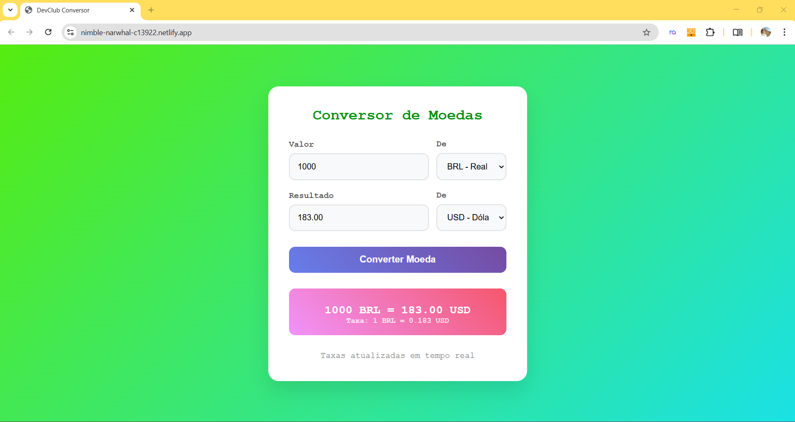

<h1>CONVERSOR DE MOEDAS</h1>

Um projeto pequeno construido em HTML, CSS e JAVASCRIPT que converte valores monetarios de varios paises com ajuda de uma API. Ideal para quem está começando na programação e quer ver o resultado prático e rapidamente. Este Readme ajuda a entender o que o projeto faz, como roda e como contribuir se for o caso.

<h2>Resumo Rápido</h2>

  <li>Tecnologia: HTML, CSS, JAVASCRIPT</li>
  <li>Objetivo: Converter valores de uma Unidade Monetaria para outra.</li>
  <li>Como rodar: Abrir o index.html no navegador </li>
  <li>Utilizando API </li>

<h2>Estruturas de Pastas</h2>

conversor de moedas

img -> imagens usadas no projeto

index.html -> ponto de entrada(Frontend)

script.js -> lógica javascript

styles.css -> estilos css

